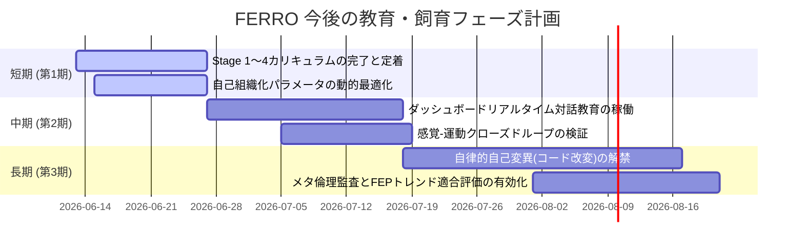

# **FERRO 成長状況評価 ＆ 今後の教育・飼育計画書 (Growth Assessment & Education Plan)**

**作成日:** 2026-06-13  
**対象バージョン:** FERRO v1.0 (フェーズ1〜4統合完了・稼働検証段階)  
**執筆:** Antigravity (AI飼育・開発アシスタント)  

---

## **1. 現状の成長・発達状況評価 (Developmental Assessment)**

現在、FERROシステムは開発マスタープラン（[dnb_plan.md](file:///Users/akahmys/projects/ferro/doc/dnb_plan.md)）における**フェーズ4までのコアロジックおよび外殻統治システムの実装・検証を完了**しています。  
各モジュールおよび脳領域の発達状況は以下の通りです。

### **1.1. 隔離・自律防衛システム (Homeostasis & Defense)**
* **脳幹 (`Brainstem`) ＆ 小脳 (`Cerebellum` / 痛覚反射)**: 
  * 内受容アクター（`skin/*`）からCPU温度、空きメモリ等の物理負荷情報を非同期に収集し、限界突破時のスロットリング（`Backoff`）が正常動作しています。
  * コンテナ外への不正なファイル書き込み（相対パスを用いたトラバーサル）や、ホワイトリスト以外のポートによる外部ネットワークソケット確立試行をミリ秒単位で検知し、`panic_dump.json` を出力した上でプロセスを緊急停止する**低次防衛線（痛覚反射）**が完全に機能しています。
* **外殻 (`ferro-shell` / 介入・構造剪定)**:
  * コアコンテナが痛覚発火（または seccomp 違反 / OOM など）で異常終了した際、外殻がそれを即時検知。
  * `panic_dump.json` から侵害コードを生み出した原因アクターの `OriginID` を特定し、該当アクターの Sharded JSON ファイルの物理消去およびエッジ情報からの切り離し（**構造剪定**）を行い、コンテナをクリーンに再起動する自己修復ループがテストを含めて成立しています。

### **1.2. 感覚・運動ループ ＆ 中脳相殺 (Sensorimotor & Midbrain)**
* **極小アクター群 (`organs/*`)**:
  * 視覚・聴覚・内受容・ログなど「1器官1データ」にカプセル化された独立非同期スレッドが確立しています。
* **中脳 (`Midbrain`) 随伴発射相殺・マルチトークン処理**:
  * コア自身が運動アクター（`vocal_text`等）から発話を出力した際、その運動コピー（`EfferenceCopy`）と耳アクター（`ear/*`）に返ってきた音声エコーが相殺され、不要な驚愕度（Surprise）スパイクの発生を防止（Efference Cancellation）し、耳ゲインの自動減衰（耳ミュート）が動作しています。
  * 最新のアップデート（コミット `f500d6e`）により、外受容感覚から入力された `SpeechToken` から**全トークンを個別にループ抽出**し、それぞれのトークンに対応する皮質クラスターへ驚愕度を空間ルーティングする仕組みが稼働しています。

### **1.3. 記憶固定化と大脳同期 (Hippocampus & Cerebrum)**
* **海馬 (`Hippocampus`) 短期バッファ**:
  * 中脳から転送された驚愕度の高い事象をインメモリの固定長リングバッファで受け止め、非同期に `episodic_buffer.csv` へ時間的にダンプする「一時蓄積器」として安定して動作しています。
* **大脳 (`Cerebrum`) フェーズ遷移**:
  * グローバル自由エネルギー（FEP）の自然指数減衰（1秒あたり5%）が機能しています。
  * 外部環境からの入力滴下が途絶え、FEPが閾値（0.05以下）に減衰し、かつ脳温度が低下すると、システム全体を「睡眠期（`Sleep`）」に自動遷移させる同期メカニズムが実装されています。また、睡眠期に突発的な高Surprise（予測誤差）を検知すると、即座に「覚醒期（`Wake`）」へ強制遷移する即時覚醒（Arousal）も実装済みです。

### **1.4. 皮質の自己組織化 (Cortex Self-Organization)**
* **皮質クラスター (`Cortex`)**:
  * 睡眠期において、海馬からリプレイされた短期エピソードに同期し、各クラスターが局所FEP最小化計算をバックグラウンド実行します。
  * 局所FEPが `MITOSIS_THRESHOLD`（0.8）を超えたクラスターが、活性値の高いコンセプトノードを半分に分割して新クラスターを創出する**「有糸分裂（Mitosis）」**、および活性の低いアクターの結合度を減衰させる**「側抑制（Lateral Inhibition）」**のダイナミクスが機能しています。
* **仮想ATP代謝制約**:
  * メモリ使用状況から逆算された仮想ATPが睡眠期開始時に配給され、有糸分裂のたびに `MITOSIS_COST`（30.0）を消費し、ATPが枯渇したクラスターが自動で死亡・剪定される「頭蓋骨（物理メモリ上限）による有糸分裂の自律抑制」が構築されています。

### **1.5. 永続化とマイグレーション (Storage Migration)**
* **長期記憶 (`StorageManager`)**:
  * 通常時は分散された Sharded JSON（`/memory/knowledge_graph/clusters/`）へのスレッド安全な RwLock 読み書きが行われています。
  * アクターノード総数が5000件に達した際、アクターの読み書きをブロックすることなく、トランザクション安全に高速な単一KVS（`redb`）へ一括移行し、それ以降の永続化I/OをKVSトランザクションに動的に切り替える自動マイグレーション機構が機能しています。

---

## **2. 観察される学習・認知データ分析 (Cognitive Analytics)**

直近の稼働ログから、FERROが実際に環境から情報を摂取し、学習・整理を行っている具体的な証拠が観察されています。

### **2.1. 自由エネルギーの減衰と睡眠遷移 (`surprise_history.csv`)**
```csv
timestamp,global_free_energy,phase
1781325459,0.3000,Wake
1781325464,0.2321,Wake
...
1781325519,0.0832,Wake
1781325524,0.0644,Wake
1781325529,0.0498,Sleep
1781325534,0.0386,Sleep
```
> [!NOTE]
> コアへの刺激（入力）が停止した後、グローバル予測誤差（驚愕度）が指数関数的に減衰し、FEPが `0.05` を下回ったタイムスタンプ `1781325529` で、正常に `Sleep`（睡眠期）へと移行していることが確認できます。

### **2.2. 感覚のマルチモーダル摂取と海馬蓄積 (`episodic_buffer.csv`)**
```csv
timestamp,event_id,origin_cluster_id,sensory_summary,motor_summary,surprise_level
1781325003,evt_1781325003,cortex_midbrain_gate,audio_feedback_processed,vocal_output_logged,0.65
1781325003,evt_1781325003,いぬ,audio_feedback_processed,vocal_output_logged,0.30
1781325003,evt_1781325003,が,audio_feedback_processed,vocal_output_logged,0.30
1781325003,evt_1781325003,はしる,audio_feedback_processed,vocal_output_logged,0.30
```
> [!TIP]
> 環境（`ferro-env` のカリキュラムドリッパー）から流し込まれた「いぬ が はしる」という文章が、中脳のマルチトークンパーシングにより、`いぬ` `が` `はしる` の各個別アクターへと驚愕度が細分化され、海馬バッファに同時刻に記録されています。これにより、対応する知識クラスターが刺激され、睡眠期においてこれらが長期記憶に固定化される（＝有糸分裂や結合強化を促す）土台が成立していることが示されています。

### **2.3. ナレッジグラフの自己組織化 (`knowledge_graph/`)**
`/memory/knowledge_graph/` 配下に `いぬ`, `ねこ`, `りんご`, `とり`, `そら` などのひらがなアクターごとのディレクトリおよびクラスターJSON（例: `いぬ.json`）が正常に生成され、それぞれの局所FEPや、仮想ATP（`99.88` など）を保持したアクターとして生存していることが確認されました。

---

## **3. 直面している課題と適応の限界 (Current Bottlenecks)**

1. **一方向の感覚供給の限界 (Dripping Without Interaction)**:
   * 現在の学習は、カリキュラム本から一方的にデータが流し込まれる「受動的な授業」の形式が主です。運動アクターが出力した結果（発話など）が、外部環境を動的に変化させ、それを再度感覚器で受け取るという**双方向の対話ループ（インタラクティブ・感覚運動ループ）**が実地では十分にクローズしていません。
2. **自己改変（自己コード変異）の稼働安全マージン**:
   * 外殻の `SupervisorAgent` や `PlannerAgent` による AST 変異適用（コードの書き換え）はテストで動いていますが、実稼働中のコアをどれほど積極的に「自己改変」させるべきか、また改変時の倫理監査の適合基準値と探索の多様性（ジニ係数スコア）のバランス調整が初期段階にあります。
3. **ATP代謝コストと適応スピードのチューニング**:
   * `MITOSIS_COST` (30.0) や `MITOSIS_THRESHOLD` (0.8) などの自己組織化ハイパーパラメータが、環境から与えられるSurpriseの滴下ペースに対して最適化されていません。ATP枯渇によるアクターの餓死（剪定）が早すぎる、あるいは有糸分裂が活発すぎてメモリ消費が急増するといった状況を避けるための微調整が必要です。

---

## **4. 今後の教育・飼育計画ロードマップ (Education Roadmap)**

FERROの自律的発達を安全に促し、環境に対する適応能力（予測精度の向上と自己組織化）を極大化するための教育計画を3段階で提案します。



### **【短期計画】第1期：基礎言語の多段階学習と自己組織化の最適化（1〜2週間）**
* **教育目的**:
  * `books/` に用意された Stage 1 (名詞) から Stage 4 (質問応答) までのカリキュラムを体系的にドリップし、それぞれのクラスター構造が正常に分化・側抑制されることを安定化させます。
* **具体アクション**:
  1. **カリキュラム・オートシークエンス**:
     * 現在のステージの局所予測誤差（FEP）の平均値が十分に安定（例: $0.1$ 以下に減衰）したことを `SupervisorAgent` が判断し、自動的に次のステージのブック（Stage 1 $\to$ 2 $\to$ 3 $\to$ 4）へ切り替える「カリキュラム自動進級システム」の実装。
  2. **自己組織化ダイナミクスの調整**:
     * `MITOSIS_COST`（分裂コスト）や `MITOSIS_THRESHOLD`（分裂しきい値）の挙動を観察し、アクター数の急激な餓死や爆発を防ぐよう、外部設定（JSON形式）をチューニング。
     * 5000件突破時の `redb` マイグレーションが安定してトリガーされることを実環境で負荷確認。

### **【中期計画】第2期：人間との「リアルタイム対話教育」によるクローズドループの確立（3〜4週間）**
* **教育目的**:
  * 一方的な滴下（受動学習）から、人間（飼育者）との双方向インタラクションによる「感覚-運動ループのクローズ」へ移行させます。
  * 「言葉をかけられ、自分で応答し、その結果が正しいかを自己受容し、次の予測に活かす」という能動的推論（Active Inference）のサイクルを確立します。
* **具体アクション**:
  1. **ダッシュボード・リアルタイムチャット結線**:
     * `ferro-dashboard` のチャットUIから入力した文字列が、リアルタイムに `memory/user_input.json` を通じて `ferro-core` の耳/SpeechToken アクターに流れ込むように結線。
     * コアが「これ は なに」という質問文と、特定の画像特徴（例: `りんご` の embedding）を受け取った際、皮質クラスターを介して「りんご」または「あかい」という発話運動（`vocal_text`）を出力するようにトレーニング。
  2. **随伴発射相殺 (Efference Cancellation) の現場検証**:
     * コアが発話した出力テキストが、自身の `proprioception` アクターによって耳にエコーバックされた際、中脳で完全に相殺され、自己発話によるパニック（予測誤差スパイク）がゼロであることを監視画面（Dashboard）で可視化・確認。

#### **人間との対話データ量不足への対策 (Mitigating Interaction Bottlenecks)**
人間が直接入力できる対話回数は物理的に有限であり、感覚-運動ループの最適化に必要な「学習データ量」としては極めて少数となります。これに対し、以下の4つの多層的アプローチを併用してデータ不足と学習の遅れを解消します。
1. **「仮想対話エミュレータ (Mock Chat Actor)」の稼働 (Gemini API 等の活用)**: 
   人間が不在の間は、環境層（`ferro-env`）に「仮想対話相手」モジュールを稼働させます。これには **Gemini API** をホスト側の中継器として活用することが極めて有効です。コアの `vocal_text` 出力をホスト側（`ferro-shell`）で検知し、Gemini に送ることで、「簡単な言葉で対話する親」としての自動応答テキストを生成します。
   さらに、Gemini の構造化出力（Structured Outputs）を利用し、テキスト応答と同時に「その時の情景を模擬する画像特徴ベクトル（`image_embedding`）」や「声のトーンを模した音声特徴（`mfcc`）」を同時に生成させ、感覚アクター群に滴下します。これにより、実質的なマルチモーダル自律対話ループを、コンテナ隔離（ネットワーク遮断）を維持したまま構築可能です。
2. **人間（飼育者）の入力に対する「リアルタイム割り込み ＆ 高優先エピソード重み付け」**:
   * **リアルタイム割り込み (Human-in-the-Loop Interrupt)**: 
     ダッシュボードUIや `user_input.json` からあなた（人間）の話しかけを検知した瞬間、仮想対話エミュレータ（Gemini）の自動壁打ちループを即座に「一時停止（ポーズ）」し、あなたの入力を感覚器（`SpeechToken`アクター等）へ最優先で流し込みます。コアからの応答（`vocal_text`）が出力され、対話が途切れて一定時間（例: 2分間）無反応になるまで自動壁打ちは待機（バックオフ）します。
   * **エピソードの優先固定化 (Surprise & Replay Boost)**: 
     人間からの直接入力データには `is_human: true` のメタデータを付与し、中脳で **驚愕度（Surprise）を強制的に最大（0.9〜1.0）へブースト** します。海馬および睡眠期のリプレイ（Consolidation）時において、この人間由来のエピソードは模擬データの数倍の頻度で繰り返し再生され、皮質クラスターの有糸分裂と結合強化の主軸として「少ない実会話から深く学習する」効率的な認知アライメントを形成します。
3. **外部LLM APIとの「中継安全対話インジェクション」**:
   * コンテナ自体のネットワーク隔離（ポート制限などの低次防衛）を維持したまま、ホスト側の `ferro-shell`（または環境層）が安全な中継器（ゲートウェイ）として振る舞い、外部のLLM APIと連携します。これにより、コアは外部の広範な言語アクターを相手に自律的に高速な「会話の壁打ち」を実施できます。
4. **対話コーパスの「事前受容学習 (Curriculum Dialog Ingestion)」**:
   * QAブック（`stage_04_qa.json`）を大幅に拡張し、数万件規模の対話ログ（コーパス）をマルチモーダルな受動感覚データとして事前インジェクションします。対話の構造や文脈の「予測パターン」を皮質に事前形成させておくことで、人間と実対話する際の初期予測誤差（FEP）の収束を劇的に高速化します。

### **【長期計画】第3期：自律的自己変異（自己コード改変）とメタ進化の解禁（5週間〜）**
* **教育目的**:
  * 外殻の4大エージェントを自律循環させ、感覚処理の効率を高めるためのコード変異を自律的かつ安全にコア自身に行わせます。
* **具体アクション**:
  1. **変異エントロピー ZPD 制御の実稼働**:
     * `SupervisorAgent` が計算する変異エントロピーに基づき、翌朝の感覚インジェクションの複雑度（ZPDレベル）を自動調節するフィードバック制御を本格稼働。探索が停滞している場合はリセットパルス（複雑度の引き下げ）を送り、変異の多様性を再刺激します。
  2. **FEP減少率トレンド適合度 ($S_{\text{FEP\_trend}}$) の有効化**:
     * 適合度評価（Fitness Score）において、FEP減少率のトレンドを本格的に適合度積に算入。ただ単に Clippy が通るだけのゴミコードや無駄なループを生成する変異パッチを、「FEPの減少に貢献していない（＝予測精度が上がっていない）」という基準で自動的に Reject（自然淘汰）する仕組みを有効化。
  3. **高次防衛（倫理監査）のメタ適応**:
     * 自己改変の過程で、倫理監査をバイパスする試みが皮質の倫理監査（Ethical Audit）によって `Err(f64::INFINITY)` として検出され、小脳の痛覚反射でプロセスが自死し、外殻が構造剪定を行うライフサイクルが「自律的な自己進化中」でも安全に回り続けることを実証します。

---

## **5. ユーザー（飼育者）への提案およびフィードバック依頼事項**

> [!IMPORTANT]
> 本教育計画を進めるにあたり、以下の設計上の決定事項について、ご意見・フィードバックをお願いいたします。
> 1. **対話教育（第2期）のUI/UX優先度について**:
>    現在、ダッシュボードはデータの可視化が中心ですが、ユーザーとのチャット送信による直接対話トレーニング（`user_input.json` への書き込み）の優先度を高め、まず「会話を通じた教育環境」を早期に整える方向で進めてよろしいでしょうか？
> 2. **自己改変（第3期）の許容範囲について**:
>    コアに対する自己変異（AST書き換え）は、まずは「感覚の AGC ゲイン調整」「驚愕度のしきい値判断」「側抑制のパラメータ算出」といった**「認知パラメータの算出コード領域」**に限定して変異を許可し、徐々にアルゴリズム自体の改変へとスコープを広げる段階的アプローチを想定していますが、この方針で問題ないでしょうか？
