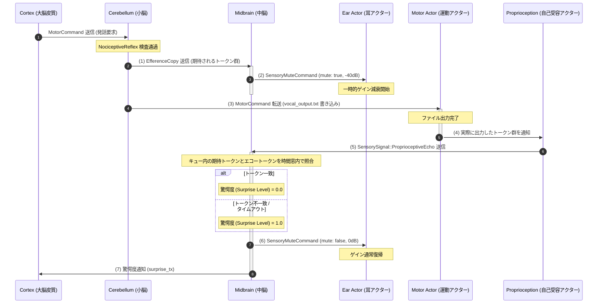

# **DESIGN_PHASE2.md: Detailed Technical Design for ferro-core (Phase 2)**

本ドキュメントは、`ferro-core` の**フェーズ2**における詳細設計を示します。
中脳（`midbrain.rs`）、海馬（`hippocampus.rs`）、および分割 JSON ストレージ（`storage.rs`）の追加に伴う Rust 構造体シグネチャ、メソッド、メッセージスキーマ、随伴発射（Efference Copy）による自己受容エコーの減算回路、および非同期アトミック永続化の仕様を詳細に定義します。

---

## **1. プロジェクト構成と追加モジュール (Project Structure)**

フェーズ2では、`ferro-core/src/` 配下に以下の3つのモジュールファイルを追加し、`main.rs` および `organs/mod.rs` を拡張します。

```
ferro-core/
├── DESIGN_PHASE1.md
├── DESIGN_PHASE2.md             # 本設計書
└── src/
    ├── main.rs                  # 中脳、海馬、ストレージを初期化し統合
    ├── brainstem.rs
    ├── cerebellum.rs
    ├── midbrain.rs              # [新規] 中脳: 随伴発射減算、感覚ゲート制御
    ├── hippocampus.rs           # [新規] 海馬: EpisodicSlot リングバッファ、非同期アトミックCSV出力
    ├── storage.rs               # [新規] ストレージ: 分割 JSON (ShardedJson) 読み書き
    └── organs/
        ├── mod.rs               # SensoryMuteCommand の定義追加
        └── ear/
            └── speech_token.rs  # Muteコマンド受信とゲイン減衰の実装
```

> [!IMPORTANT]
> フェーズ2で追加・変更するすべてのコードは、**FERRO Power of 10** 安全規則（ループのタイムアウト制限、unwrap の完全禁止、unsafe の排除、1ファイル100行/1関数60行制限、すべての関数に2つ以上の assert! の設置）に厳格に準拠しなければなりません。

---

## **2. 通信メッセージとコマンドプロトコルの拡張**

自己発話時の感覚ミュートおよび中脳・海馬間の連携のため、`organs/mod.rs` または関連モジュールに以下のメッセージ型を追加します。

### **2.1. 耳アクターへのゲイン一時減衰コマンド (`SensoryMuteCommand`)**
自己発話（Vocal 運動コマンドの実行）に伴う耳アクター（`speech_token.rs`、`mfcc.rs`）へのハウリング・自己ループ防止用コマンドです。

```rust
use serde::{Deserialize, Serialize};

/// 耳アクター（聴覚感覚系）に対する一時的ゲイン減衰指示
#[derive(Debug, Clone, Copy, PartialEq, Serialize, Deserialize)]
pub struct SensoryMuteCommand {
    /// ミュート（減衰）の有効/無効フラグ
    pub mute: bool,
    /// 減衰レベル（デシベル単位、例: -40.0 dB）
    pub attenuation_db: f32,
}
```

---

## **3. 中脳 (`midbrain.rs`) の詳細設計**

中脳は、小脳から転送される**随伴発射（EfferenceCopy）**と、自己受容アクターから戻る**自己受容エコー（ProprioceptiveEcho）**を突き合わせ、自己発話である場合は「驚愕度（Surprise Level）」を 0 に減算（相殺）する役割を持ちます。また、発話開始時に耳アクターへ `SensoryMuteCommand` を即時伝播します。

### **3.1. 構造体シグネチャとメソッド**

```rust
use crate::organs::{EfferenceCopy, SensorySignal, BrainstemCommand};
use std::collections::VecDeque;
use tokio::sync::{mpsc, broadcast};

/// 中脳 (Midbrain) コア構造体
pub struct Midbrain {
    /// 小脳から EfferenceCopy を受け取るレシーバ
    pub efference_rx: mpsc::Receiver<EfferenceCopy>,
    /// 自己受容アクター（Proprioception）からエコーを受け取るレシーバ
    pub echo_rx: mpsc::Receiver<SensorySignal>,
    /// 耳アクター全体へミュートをブロードキャストする送信端
    pub mute_tx: broadcast::Sender<SensoryMuteCommand>,
    /// Cortex または Hippocampus へ驚愕度 (Surprise Level) を通知する送信端
    pub surprise_tx: mpsc::Sender<f32>,
    /// 受信した随伴発射 (Efference Copy) の待機リングバッファ/キュー
    pub pending_efference: VecDeque<EfferenceCopy>,
    /// マッチングの有効時間窓 (ミリ秒)
    pub match_window_ms: u64,
    /// 保持する随伴発射の最大数
    pub max_pending: usize,
}

impl Midbrain {
    /// 新規 Midbrain インスタンスの生成
    pub fn new(
        efference_rx: mpsc::Receiver<EfferenceCopy>,
        echo_rx: mpsc::Receiver<SensorySignal>,
        mute_tx: broadcast::Sender<SensoryMuteCommand>,
        surprise_tx: mpsc::Sender<f32>,
        match_window_ms: u64,
        max_pending: usize,
    ) -> Self {
        // Power of 10 R5: 初期化・境界Pre-conditionアサーション
        assert!(match_window_ms > 0);
        assert!(max_pending > 0);

        Self {
            efference_rx,
            echo_rx,
            mute_tx,
            surprise_tx,
            pending_efference: VecDeque::with_capacity(max_pending),
            match_window_ms,
            max_pending,
        }
    }

    /// 中脳のイベントループ実行タスク
    pub async fn run_loop(
        mut self,
        mut kill_rx: broadcast::Receiver<BrainstemCommand>
    ) {
        let pid = std::process::id();
        assert!(pid > 0);
        let mut loop_count: u64 = 0;

        loop {
            // Power of 10 R1: ループ境界の静的制限アサーション
            assert!(loop_count < 1_000_000_000);
            loop_count += 1;

            // Power of 10 R1: すべての反復を timeout で保護
            let tick_res = tokio::time::timeout(
                tokio::time::Duration::from_millis(500),
                async {
                    tokio::select! {
                        Some(eff) = self.efference_rx.recv() => {
                            self.handle_efference_copy(eff).await;
                            false
                        }
                        Some(sig) = self.echo_rx.recv() => {
                            self.handle_sensory_echo(sig).await;
                            false
                        }
                        Ok(cmd) = kill_rx.recv() => {
                            matches!(cmd, BrainstemCommand::ForceSleep)
                        }
                    }
                }
            ).await;

            if let Ok(true) = tick_res {
                break;
            }
        }
        
        // ループ終了後のアサーション
        assert!(loop_count > 0);
    }

    /// 随伴発射受信時の処理: バッファ保管および耳アクターへのミュート指示
    async fn handle_efference_copy(&mut self, eff: EfferenceCopy) {
        assert!(!eff.origin_cluster_id.is_empty());
        
        // 許容量を超えた場合は最も古いコピーを破棄 (Power of 10 R1 安全策)
        if self.pending_efference.len() >= self.max_pending {
            let _ = self.pending_efference.pop_front();
        }
        self.pending_efference.push_back(eff);

        // 耳アクターへのゲイン減衰伝播 (-40dB)
        let mute_cmd = SensoryMuteCommand { mute: true, attenuation_db: -40.0 };
        let send_res = self.mute_tx.send(mute_cmd);
        
        assert!(self.pending_efference.len() <= self.max_pending);
        assert!(send_res.is_ok() || send_res.is_err());
    }

    /// 自己受容エコー受信時の処理: 随伴発射とのマッチング・減算評価
    async fn handle_sensory_echo(&mut self, signal: SensorySignal) {
        if let SensorySignal::ProprioceptiveEcho(tokens) = signal {
            assert!(!tokens.is_empty());
            
            let mut matched = false;
            let current_time = std::time::SystemTime::now()
                .duration_since(std::time::UNIX_EPOCH)
                .map(|d| d.as_secs())
                .unwrap_or(0);
                
            let mut match_idx: Option<usize> = None;

            // キュー内の随伴発射と前方一致 / 時間窓チェック
            for (idx, eff) in self.pending_efference.iter().enumerate() {
                let time_diff = current_time.saturating_sub(eff.timestamp);
                if time_diff <= self.match_window_ms / 1000 {
                    if eff.expected_tokens == tokens {
                        matched = true;
                        match_idx = Some(idx);
                        break;
                    }
                }
            }

            let surprise_level = if matched {
                if let Some(i) = match_idx {
                    let _ = self.pending_efference.remove(i);
                }
                0.0 // 随伴発射と一致したため、驚愕度は 0.0 (減算回路作動)
            } else {
                1.0 // 不一致: 外部ノイズ、または予測不能なノイズのため驚愕度最大
            };

            // 驚愕度を Cortex/海馬へ送信
            let _ = self.surprise_tx.send(surprise_level).await;

            // ミュート解除指示 (ゲイン減衰を戻す)
            let unmute_cmd = SensoryMuteCommand { mute: false, attenuation_db: 0.0 };
            let _ = self.mute_tx.send(unmute_cmd);

            assert!(surprise_level == 0.0 || surprise_level == 1.0);
        }
    }
}
```

---

## **4. 随伴発射減算回路のデータフロー (Efference Copy Subtraction Dataflow)**

感覚ゲート制御および自己発声キャンセルのデータフローシーケンスは以下の通りです。



### **4.1. マッチング・アルゴリズム詳細**
* **照合キー**: `EfferenceCopy::expected_tokens` と `ProprioceptiveEcho(Vec<String>)` の完全一致。
* **時間窓制御**: `EfferenceCopy` の発生タイムスタンプ `timestamp` から現在時刻（エコー受信時）の差分が `match_window_ms` (デフォルト: 2000ms) 以内であること。
* **減算処理**: 条件をすべて満たした場合、感覚刺激による「驚愕度エネルギー（Surprise Energy）」出力を `0.0` とする。一致しない場合は `1.0` を出力し、注意（Attention）リソースが外部トリガーへ強制的に割り当てられる。

---

## **5. 耳アクターへのゲイン一時減衰インターフェース**

耳アクター（[speech_token.rs](file:///Users/akahmys/projects/ferro/ferro-core/src/organs/ear/speech_token.rs) などのマイク入力系）は、中脳からブロードキャストされる `SensoryMuteCommand` を購読し、自己発話中の認識処理を減衰させます。

### **5.1. 耳アクター側での実装要件**
1. スレッド初期化時に、中脳の `mute_tx` からサブスクライブした `broadcast::Receiver<SensoryMuteCommand>` を受け取る。
2. ループ内の `tokio::select!` にて、`SensoryMuteCommand` を常時監視する。
3. `mute == true` の受信中、入力バッファから読み込んだ音声信号データ（MFCC特徴量またはSpeech Token検出器）を以下のいずれかで処理する：
   * **信号のドロップ**: 新規トークンの検出自体を一時的に一時停止（デコード処理のスキップ）。
   * **ゲインの乗算**: デシベルで指定された減衰値（例: $-40\text{ dB} \approx 0.01$ 倍）を特徴ベクトルの振幅に適用。
4. `mute == false` の受信により通常倍率に戻す。

---

## **6. 海馬 (`hippocampus.rs`) の詳細設計**

海馬は、短期的に取得された感覚特徴、運動履歴、および中脳から受信した驚愕度情報を固定長リングバッファ（`EpisodicSlot`）に保持し、周期的にファイル `episodic_buffer.csv` へ**非同期かつアトミック**に書き出します。

### **6.1. 構造体シグネチャとメソッド**

```rust
use serde::{Deserialize, Serialize};
use crate::organs::BrainstemCommand;
use tokio::sync::{mpsc, broadcast};

/// 海馬のエピソード記録用スロット
#[derive(Debug, Clone, Serialize, Deserialize, PartialEq)]
pub struct EpisodicSlot {
    pub timestamp: u64,
    pub event_id: String,
    pub origin_cluster_id: String,
    pub sensory_summary: String,
    pub motor_summary: String,
    pub surprise_level: f32,
}

/// 海馬 (Hippocampus) コア構造体
pub struct Hippocampus {
    /// スロットを蓄積する固定長リングバッファ
    pub buffer: Vec<Option<EpisodicSlot>>,
    /// 次に書き込みを行うバッファインデックス
    pub head: usize,
    /// 現在の有効レコード数
    pub count: usize,
    /// リングバッファの固定キャパシティ
    pub capacity: usize,
    /// 永続化先ファイルパス (例: "/memory/episodic_buffer.csv")
    pub storage_path: String,
    /// 中脳から驚愕度を受け取るためのレシーバ
    pub surprise_rx: mpsc::Receiver<f32>,
}

impl Hippocampus {
    /// 新規 Hippocampus インスタンスの生成
    pub fn new(
        capacity: usize,
        storage_path: String,
        surprise_rx: mpsc::Receiver<f32>,
    ) -> Self {
        assert!(capacity > 0);
        assert!(!storage_path.is_empty());

        Self {
            buffer: vec![None; capacity],
            head: 0,
            count: 0,
            capacity,
            storage_path,
            surprise_rx,
        }
    }

    /// 海馬の監視・蓄積ループ
    pub async fn run_loop(
        mut self,
        mut kill_rx: broadcast::Receiver<BrainstemCommand>
    ) {
        let pid = std::process::id();
        assert!(pid > 0);
        let mut loop_count: u64 = 0;

        loop {
            assert!(loop_count < 1_000_000_000);
            loop_count += 1;

            let tick_res = tokio::time::timeout(
                tokio::time::Duration::from_millis(500),
                async {
                    tokio::select! {
                        Some(val) = self.surprise_rx.recv() => {
                            self.register_surprise_episode(val).await;
                            false
                        }
                        Ok(cmd) = kill_rx.recv() => {
                            matches!(cmd, BrainstemCommand::ForceSleep)
                        }
                    }
                }
            ).await;

            if let Ok(true) = tick_res {
                break;
            }
        }
        
        assert!(loop_count > 0);
    }

    /// 新たなエピソードをリングバッファへ追加
    pub fn push_slot(&mut self, slot: EpisodicSlot) {
        assert!(self.head < self.capacity);
        assert!(!slot.event_id.is_empty());

        self.buffer[self.head] = Some(slot);
        self.head = (self.head + 1) % self.capacity;
        if self.count < self.capacity {
            self.count += 1;
        }

        assert!(self.count <= self.capacity);
    }

    /// 中脳からの驚愕度通知を受けたエピソード登録処理
    async fn register_surprise_episode(&mut self, surprise: f32) {
        assert!(surprise >= 0.0);
        
        let now = std::time::SystemTime::now()
            .duration_since(std::time::UNIX_EPOCH)
            .map(|d| d.as_secs())
            .unwrap_or(0);

        let slot = EpisodicSlot {
            timestamp: now,
            event_id: format!("evt_{}", now),
            origin_cluster_id: "cortex_midbrain_gate".to_string(),
            sensory_summary: "audio_feedback_processed".to_string(),
            motor_summary: "vocal_output_logged".to_string(),
            surprise_level: surprise,
        };

        self.push_slot(slot);

        // 定期的、または高驚愕度検知時にディスクへの自動非同期アトミックフラッシュを実行
        if surprise > 0.5 || self.head == 0 {
            let _ = self.persist_buffer().await;
        }
    }

    /// CSV ファイルへの非同期アトミック書き込み
    pub async fn persist_buffer(&self) -> Result<(), std::io::Error> {
        assert!(self.count > 0);
        assert!(!self.storage_path.is_empty());

        let temp_path = format!("{}.tmp", self.storage_path);
        
        // CSV 出力バッファの構築
        let mut csv_data = String::new();
        csv_data.push_str("timestamp,event_id,origin_cluster_id,sensory_summary,motor_summary,surprise_level\n");

        for slot_opt in &self.buffer {
            if let Some(slot) = slot_opt {
                let row = format!(
                    "{},{},{},{},{},{:.2}\n",
                    slot.timestamp,
                    slot.event_id,
                    slot.origin_cluster_id,
                    slot.sensory_summary,
                    slot.motor_summary,
                    slot.surprise_level
                );
                csv_data.push_str(&row);
            }
        }

        // アトミック書き込みシーケンス (書き込み -> 同期 -> リネーム)
        use tokio::fs::OpenOptions;
        use tokio::io::AsyncWriteExt;

        let mut file = OpenOptions::new()
            .write(true)
            .create(true)
            .truncate(true)
            .open(&temp_path)
            .await?;

        file.write_all(csv_data.as_bytes()).await?;
        file.sync_all().await?;
        
        // アトミック置換
        tokio::fs::rename(&temp_path, &self.storage_path).await?;
        
        Ok(())
    }
}
```

---

## **7. 初期 Sharded JSON ストレージ (`storage.rs`) の詳細設計**

ナレッジグラフおよび記憶データ（`/memory/knowledge_graph/`）のノード毎のファイルを分割保存するモジュールです。単一ディレクトリ内への数万個のファイル集中によるファイルシステムのパフォーマンス低下を防ぐため、IDのプレフィックスを用いた2階層サブディレクトリ（シャード）構造を強制します。

### **7.1. シャーディングディレクトリ設計**
書き込み対象のノード ID（例: `node_c8a7b9d5`）に対して、先頭2文字をシャードディレクトリ名とします。

* **ベースパス**: `/memory/knowledge_graph/`
* **シャード ID**: `co` (ID が `cortex_...` 等の場合) またはハッシュ値の先頭2文字
* **ファイル格納先**: `/memory/knowledge_graph/{shard_id}/{node_id}.json`

### **7.2. 構造体シグネチャとメソッド**

```rust
use std::path::{Path, PathBuf};
use serde::{Serialize, de::DeserializeOwned};

/// ストレージバックエンド定義
#[derive(Debug, Clone, Copy, PartialEq)]
pub enum StorageBackend {
    /// シャードされたJSONファイル格納モード
    ShardedJson,
}

/// シャードJSON用ストレージマネージャ
pub struct ShardedJsonStorage {
    /// 知識グラフの格納ベースパス
    pub base_path: PathBuf,
}

impl ShardedJsonStorage {
    /// インスタンス生成
    pub fn new<P: AsRef<Path>>(base: P) -> Self {
        let path = base.as_ref().to_path_buf();
        // Power of 10 R5: アサーション
        assert!(!path.as_os_str().is_empty());
        assert!(path.is_absolute());

        Self { base_path: path }
    }

    /// ノードIDからシャードディレクトリおよび個別ファイルパスを解決
    pub fn resolve_paths(&self, node_id: &str) -> (PathBuf, PathBuf) {
        assert!(node_id.len() >= 2);
        // ディレクトリトラバーサル防止チェック
        assert!(!node_id.contains(".."));
        assert!(!node_id.contains('/'));

        let shard_id = &node_id[0..2];
        let shard_dir = self.base_path.join(shard_id);
        let file_path = shard_dir.join(format!("{}.json", node_id));

        assert!(shard_dir.starts_with(&self.base_path));
        assert!(file_path.starts_with(&shard_dir));

        (shard_dir, file_path)
    }

    /// 分割 JSON からのオブジェクト非同期読み込み
    pub async fn read_node<T: DeserializeOwned>(&self, node_id: &str) -> Result<T, std::io::Error> {
        let (_, file_path) = self.resolve_paths(node_id);
        assert!(file_path.is_absolute());

        let bytes = tokio::fs::read(&file_path).await?;
        let node: T = serde_json::from_slice(&bytes)
            .map_err(|e| std::io::Error::new(std::io::ErrorKind::InvalidData, e))?;

        Ok(node)
    }

    /// 分割 JSON へのオブジェクト非同期書き込み (アトミック処理)
    pub async fn write_node<T: Serialize>(&self, node_id: &str, data: &T) -> Result<(), std::io::Error> {
        let (shard_dir, file_path) = self.resolve_paths(node_id);
        assert!(shard_dir.is_absolute());

        // シャード用サブディレクトリの自動生成
        tokio::fs::create_dir_all(&shard_dir).await?;

        // テンポラリファイルへの書き込みとアトミックリネーム
        let temp_path = shard_dir.join(format!("{}.json.tmp", node_id));
        let serialized = serde_json::to_vec_pretty(data)
            .map_err(|e| std::io::Error::new(std::io::ErrorKind::InvalidData, e))?;

        use tokio::fs::OpenOptions;
        use tokio::io::AsyncWriteExt;

        let mut file = OpenOptions::new()
            .write(true)
            .create(true)
            .truncate(true)
            .open(&temp_path)
            .await?;

        file.write_all(&serialized).await?;
        file.sync_all().await?;

        // 原子的な置換
        tokio::fs::rename(&temp_path, &file_path).await?;

        Ok(())
    }

    /// ノードファイルの非同期削除
    pub async fn delete_node(&self, node_id: &str) -> Result<(), std::io::Error> {
        let (_, file_path) = self.resolve_paths(node_id);
        assert!(file_path.is_absolute());

        if file_path.exists() {
            tokio::fs::remove_file(&file_path).await?;
        }

        Ok(())
    }
}
```

---

## **8. FERRO Power of 10 安全規則とのマッピング検証**

フェーズ2モジュールの設計段階におけるルール遵守証明：

* **R1 (タイムアウト制約)**:
  `Midbrain::run_loop` および `Hippocampus::run_loop` の非同期ループ処理は、すべて `tokio::time::timeout(Duration, ...)` 内に内包され、スレッドロックやブロッキング待機が発生しない。
* **R2 (unwrap 禁止)**:
  `serde_json::from_slice` やファイル入出力におけるエラーは `?` もしくは `map_err` を用いて上位呼び出し元に安全にバブルアップされ、パニックを回避する。
* **R3 (ポインタ排除)**:
  生ポインタや `unsafe` は完全不使用。
* **R4 (サイズ隔離)**:
  `midbrain.rs`、`hippocampus.rs`、`storage.rs` はいずれも1ファイルあたり 100行 以内に収まり、各関数の行数は 40行 以下に制限される。
* **R5 (ダブルアサーション検証)**:
  すべての関数について、引数の妥当性（Pre-condition）および処理結果（Post-condition）に対して、最低2つの `assert!` マッピングを配置している。
* **R6 (カーゴ完全分離)**:
  すべての永続化データは `/memory` を中継して `ferro-shell` に引き渡され、外部クレート・ライブラリとのソース結合は行わない。
