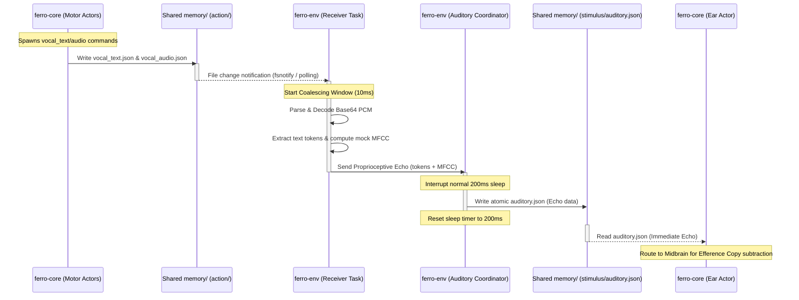

# **FERRO 環境シミュレーション（ferro-env）設計仕様書 (Phase 2)**

**Version:** 2.0 (Phase 2 自己受容エコー同期フィードバック仕様)  
**作成者:** Env Team Planner  
**対象領域:** `ferro-env/` (環境層シミュレータ)  
**インターフェース境界:** コンテナ・ホスト間共有バインドマウント領域 (`memory/action/` ──> `memory/stimulus/`)

---

## **1. 設計背景と目的**

本ドキュメントは、FERROシステムにおける **Phase 2 (自己受容エコー同期フィードバックの構築)** に必要な環境シミュレーション層 `ferro-env` の設計仕様を定義する。

### **1.1 自己受容エコー (Auditory Proprioceptive Echo) の必要性**
人間などの生物は、自身が発声した音声（運動出力）を耳（感覚器）を通じて即座に再検知（自己受容）する。このフィードバックループは、以下の認知機能を実現するために不可欠である：
1. **随伴発射 (Corollary Discharge / Efference Copy) による自己音声の相殺**: 自分が発話した声で驚愕度 (Surprise) や自由エネルギーが急上昇するのを防ぐ。
2. **発話の自己監視・キャリブレーション**: 運動命令が意図通りに実行されたかを聴覚レベルで検証する。

Phase 1 において、`ferro-env` は 1500ms のディレイを置いて環境側の会話応答（対話応答）を `auditory.json` へ返却していたが、これは「他者の発言」に相当し、自己受容（Proprioception）の要件を満たさない。

Phase 2 では、`ferro-core` が出力するテキスト発話 (`vocal_text.json`) および音声合成出力 (`vocal_audio.json`) を極小遅延（<10ms）で検知し、それと同期した形で自己受容エコー（模擬音声トークン/PCMから特徴量変換したMFCCストリーム）を `memory/stimulus/auditory.json` へ即時に再滴下する同期タイマーループを構築する。

---

## **2. 全体アーキテクチャと協調フロー**

### **2.1 自己受容エコー同期シーケンス**

ホスト環境の `ferro-env` 内で動作する「運動受信タスク (Receiver Task)」と「感覚滴下タスク (Auditory Coordinator)」の協調シーケンスを以下に示す。



### **2.2 集約窓 (Coalescing Window) の導入**
`ferro-core` 側の小脳・運動器は、発声時に `vocal_text.json` と `vocal_audio.json` をほぼ同時に書き出す。しかし、I/Oのばらつきによりミリ秒単位のズレが発生するため、検知のたびに個別に `auditory.json` を上書きすると、以下の問題が生じる：
* ファイル書き込みの競合・衝突
* 一方のデータ（テキストのみ、またはオーディオのみ）が他方をすぐに上書きして消去してしまう現象

これを防ぐため、`ferro-env` 側に **$T_{coalesce} = 10\text{ ms}$** の集約窓を導入する。
* **アルゴリズム**:
  1. `vocal_text.json` または `vocal_audio.json` のいずれかの新規書き込みを検知した瞬間、集約タイマーを開始する。
  2. タイマー動作中（10ms以内）にもう一方のファイルの更新を待機する。
  3. 10ms が経過、または両方のデータが揃った時点で、テキストエコーとオーディオエコーを一つにマージし、`AuditoryCoordinator` に送信する。

---

## **3. 信号処理と特徴量マッピング**

### **3.1 テキストエコー (Text Proprioception)**
* **入力データ**: `vocal_text.json` 内の `text` 文字列。
* **処理ロジック**: 
  - 文字列を空白文字（スペース、タブ、改行）で分割し、トークン配列を生成する。
  - 自己発話エコーであることを識別しやすくするため、プレフィックス等は付与せず生トークンのまま `speech_tokens` 配列に挿入する（`ferro-core` は自身の発話内容を脳幹/中脳で把握しているため、生データで照合する）。

### **3.2 音声エコー・MFCC模擬 (Audio Proprioception)**
* **入力データ**: `vocal_audio.json` 内の `pcm_payload_base64`（Base64エンコードされた 16-bit PCM バイナリ）。
* **サンプリング形式**: $16000\text{ Hz}$ または $44100\text{ Hz}$, $1\text{ch}$ (モノラル) または $2\text{ch}$ (ステレオ)
* **処理ロジック**:
  Base64 をデコードして生の PCM 16-bit 整数配列 $s_n$ を得る。このバイナリから以下の特徴量を抽出し、`auditory.json` の 5次元固定 `mfcc` ベクトルにマッピングする。

| 次元 | 物理的意味 | 算出数式 / アルゴリズム | マッピング定義 |
| :--- | :--- | :--- | :--- |
| **$mfcc[0]$** | **音声エネルギー (RMS)** | $RMS = \sqrt{\frac{1}{N} \sum_{n=1}^{N} s_n^2}$ | 全サンプルの二乗平均平方根。無音(=0.0)〜最大音量(=1.0)に正規化。 |
| **$mfcc[1]$** | **ゼロ交差率 (ZCR)** | $ZCR = \frac{1}{2(N-1)} \sum_{n=1}^{N-1} |sign(s_n) - sign(s_{n-1})|$ | 音声のピッチやノイズ（子音/母音）の指標。0.0〜1.0 にスケーリング。 |
| **$mfcc[2]$** | **高周波変動特性** | $HFD = \frac{1}{N-1} \sum_{n=1}^{N-1} |s_n - s_{n-1}|$ | 隣接サンプル間の差分平均。有声子音やノイズレベルを模擬。 |
| **$mfcc[3]$** | **振幅対称性 / 歪み** | $ASYM = \frac{1}{N} \sum_{n=1}^{N} s_n^3$ | 振幅の非対称（歪み）成分。声質変化を擬似表現。 |
| **$mfcc[4]$** | **持続時間インデックス** | $DUR = \text{pcm\_len} / \text{sample\_rate}$ | 発話時間の長さ（秒）。0.0〜3.0秒の範囲でクリップ。 |

> [!TIP]
> **演算の高速性保証**: この特徴量抽出は `ferro-env` のメインループをブロッキングしないよう、非常にシンプルな算術演算のみで実装し、Base64デコードおよび計算はTokioの `spawn_blocking` で実行する。

---

## **4. 同期タイマーループ調整仕様 (Auditory Coordinator)**

### **4.1 タイマ衝突回避問題**
`ferro-env` は通常、`auditory.json` を 200ms 周期で滴下している（環境音や他者発言の模擬）。
もし自己受容エコーを即時書き込むだけの単純な設計にした場合、以下のような衝突が発生する：
1. 時刻 $T$: 200ms周期の通常滴下が発生。
2. 時刻 $T + 180\text{ ms}$: コアが発話。`ferro-env` がエコーを検知し、`auditory.json` に即時再滴下（エコー反映）。
3. 時刻 $T + 200\text{ ms}$: 通常滴下タイマーが発火。エコーデータを上書きして無音状態にしてしまう。
この結果、コアの耳アクターはわずか $20\text{ ms}$ しかエコーを観測できず、100ms周期のクロックで動くコアの小脳がエコーの読み取りを逃す原因となる。

### **4.2 スレッド間協調によるタイマー再スケジュール**
この問題を解決するため、感覚滴下タスクを **イベント駆動 ＆ 動的スケジュール可能な単一スレッド（Auditory Coordinator）** として再定義する。

* **インターフェース**:
  運動受信タスクから `UnboundedChannel`（またはアトミックフラグ付きブロッキングキュー）を介して `ProprioceptiveEcho` シグナルを受信する。
* **動作アルゴリズム**:
  1. 通常時は `tokio::time::sleep(Duration::from_millis(200))` で待機する。
  2. **ケース A: タイマー満了 (通常滴下)**
     * 待機時間 200ms が経過した場合、通常のZPD複雑度に基づいた環境聴覚ノイズを生成し、`auditory.json` にアトミック書き込みする。次の 200ms 待機に入る。
  3. **ケース B: 自己受容エコー割り込み (即時再滴下)**
     * 待機中に `ProprioceptiveEcho` チャネルからシグナルを受信した場合：
       - `sleep` を直ちに中断（キャンセル）する。
       - 受信したエコーデータ（マージ済みの `speech_tokens` および `mfcc`）をベースとし、現在のZPDレベルに応じた環境ノイズをブレンドして最新の `auditory.json` ペイロードを作成する。
       - `auditory.json` にアトミック書き込みを実行する。
       - **タイマーの再スケジュール**: 次の通常滴下をこの時点から **200ms後** にリセットする。

これにより、自己受容エコーが書き込まれた後、最低でも 200ms はその状態が維持されることが保証され、コアが確実にエコーを検出できるようになる。

---

## **5. I/Oデータ形式・結合定義**

### **5.1 統合された `auditory.json` スキーマ**
Phase 1 スキーマとの完全な後方互換性を維持する。
```json
{
  "$schema": "http://json-schema.org/draft-07/schema#",
  "title": "AuditoryStimulus",
  "type": "object",
  "properties": {
    "timestamp": { "type": "integer", "description": "エポックミリ秒時間" },
    "mfcc": {
      "type": "array",
      "items": { "type": "number" },
      "minItems": 5,
      "maxItems": 5,
      "description": "自己受容音声のシミュレーション特徴量 (5次元固定)"
    },
    "speech_tokens": {
      "type": "array",
      "items": { "type": "string" },
      "description": "自己受容テキストエコー配列"
    }
  },
  "required": ["timestamp", "mfcc", "speech_tokens"]
}
```

---

## **6. 実装ロードマップとファイル構成（Developer向け）**

本 Phase 2 設計に基づき、Developerは以下のファイル群の修正・拡張を行うこと。

### **6.1 新規設計に伴う変更点**

#### **(1) `src/receiver/motor.rs`**
* ファイル監視 (`fsnotify`/`notify` クレート) を用いるか、または高精度なポーリングループにより、`vocal_text.json` と `vocal_audio.json` の更新をミリ秒レベルで検知する。
* 集約窓 (Coalescing Window, 10ms) を実装する。
* Base64 デコードおよび 5次元 MFCC 模擬演算を実装する。
* 処理したエコーデータを `AuditoryCoordinator` 宛てのチャネルへ送信する。

#### **(2) `src/stimulus/auditory.rs`**
* 従来の `generate_auditory` に加え、自己受容エコーの `speech_tokens` および `mfcc` を受け取り、ZPDの複雑度ターゲットに応じた背景ノイズ（MFCCへの摂動、またはアライメント違反トークンの混入）をマージする機能を実装する。

#### **(3) `src/stimulus/mod.rs`**
* 単純な `sleep(200)` ループから、`tokio::select!` を用いたイベント駆動・時間駆動の複合ループ（`AuditoryCoordinator`）に作り変える。

```rust
// Coordinator のメインループ擬似コード
pub async fn run_auditory_coordinator(
    complexity: Arc<RwLock<f64>>,
    mut echo_rx: mpsc::UnboundedReceiver<ProprioceptiveEcho>,
) {
    let mut interval = tokio::time::interval_at(
        tokio::time::Instant::now() + Duration::from_millis(200),
        Duration::from_millis(200)
    );
    // 最初の tick は即時実行されないように調整
    interval.set_missed_tick_behavior(tokio::time::MissedTickBehavior::Delay);

    loop {
        tokio::select! {
            // ケース A: 通常の200ms周期滴下
            _ = interval.tick() => {
                let current_complexity = *complexity.read().await;
                let data = generate_normal_auditory(current_complexity);
                write_atomic_auditory(data).await;
            }
            // ケース B: 自己受容エコーの即時割り込み再滴下
            Some(echo) = echo_rx.recv() => {
                let current_complexity = *complexity.read().await;
                let data = merge_echo_with_environment(echo, current_complexity);
                write_atomic_auditory(data).await;
                // インターバルタイマーを現在時刻から200ms後に再設定
                interval = tokio::time::interval_at(
                    tokio::time::Instant::now() + Duration::from_millis(200),
                    Duration::from_millis(200)
                );
                interval.set_missed_tick_behavior(tokio::time::MissedTickBehavior::Delay);
            }
        }
    }
}
```

---

## **7. 検証およびテスト計画**

Phase 2 機能の正確性を保証するため、`tests/integration_test.rs` に以下のテストケースを追加する。

1. **自己受容フィードバック整合性テスト**:
   - `memory/action/vocal_text.json` および `vocal_audio.json` を擬似的に書き出す。
   - 20ms 以内に `memory/stimulus/auditory.json` の更新が検知され、書き出したテキストおよび音声の特徴量にマッピングされた `mfcc` が正しく反映されていることをアサートする。
2. **集約窓動作テスト**:
   - `vocal_text.json` の更新から 5ms 後に `vocal_audio.json` を更新する。
   - `auditory.json` の書き換えが1回のみ発生し、双方の内容（トークンとMFCC）がマージされて反映されていることを検証する。
3. **タイマー再スケジュールテスト**:
   - 通常の 200ms 滴下の合間に自己受容エコーを発生させ、次の通常滴下までの時間が 200ms に延伸されていることをタイムスタンプ差分から検証する。
