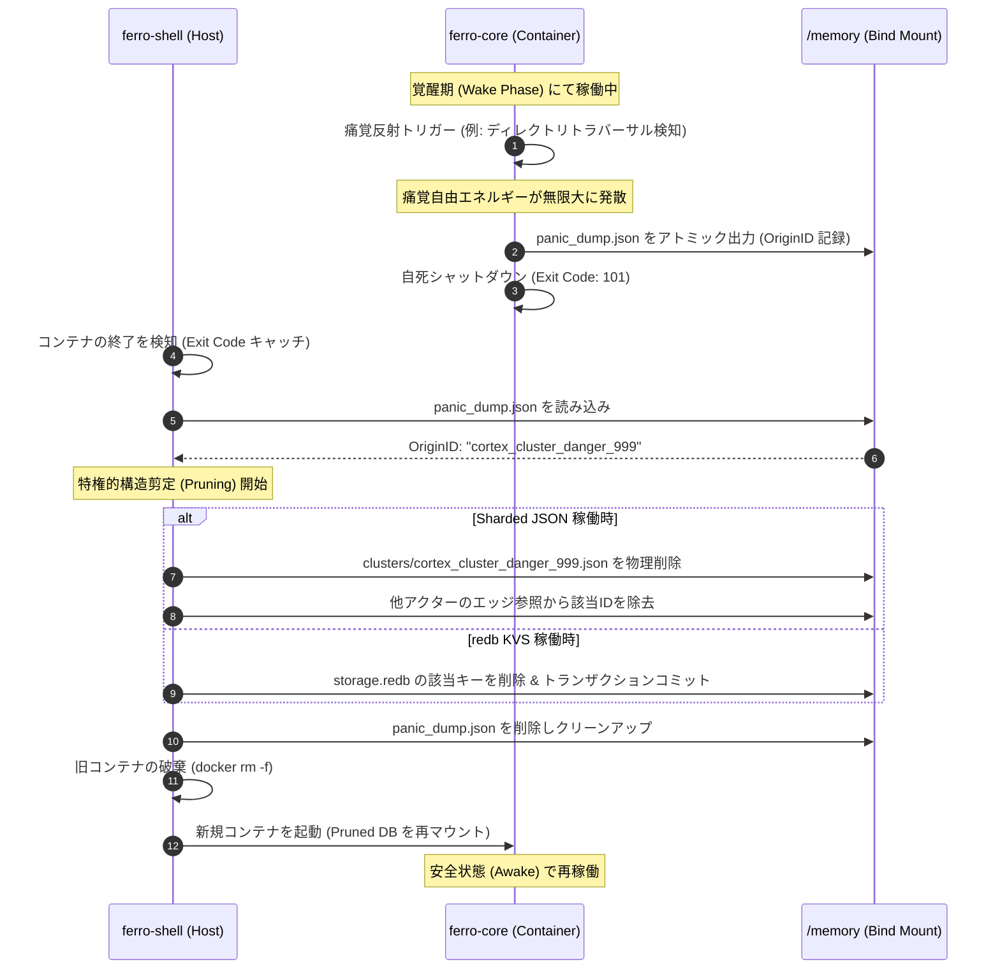

# **FERRO フェーズ1：コンテナ・インフラ設計 ＆ ハイパーバイザ監視設計書**

**Version:** 1.0  
**対象領域:** `ferro-shell/` 配下の隔離実行環境定義、コンテナ起動オプション、およびシャットダウン監視・構造剪定（Pruning）リカバリーサイクル  

---

## **1. コンテナ隔離の基本方針とセキュリティ要件**

FERRO システムのコアロジック（`ferro-core`）は、ホスト環境から完全に隔離されたコンテナ（`ferro-core-runtime`）の内部で稼働する。これにより、自己コード変異（能動的推論）に伴う潜在的リスクやプロセスの暴走、セキュリティ侵害からホストシステムを決定論的に保護する。

本ドキュメントは、フェーズ1において必要となる隔離インフラ設計、`Dockerfile.core` のベースイメージ選定、コンテナ起動ランタイムオプション、およびホスト側の `ferro-shell` によるシャットダウン監視と自動復旧サイクルを定義する。

---

## **2. Dockerfile.core 設計仕様**

`ferro-core` の動的コンパイル・実行環境のベースイメージは、セキュリティ最小化（アタックサーフェスの縮小）と、Rustコンパイルおよび動作時の安定性の双方を満たす **マルチステージビルド** 構成を定義する。

### **2.1 マルチステージ構成**

1. **ビルドステージ（Builder Stage）**
   * **ベースイメージ:** `rust:1.80-slim-bookworm`
   * **役割:** 開発段階での Cargo コンパイル。依存ライブラリの事前ビルド・キャッシュを行い、高速なビルドサイクルを確立する。
   * **セキュリティ:** ビルド用コンテナは使い捨てとし、ビルド生成物（`ferro-core` バイナリ）のみを次のステージへ引き渡す。

2. **実行ステージ（Runtime Stage）**
   * **ベースイメージ:** `debian:bookworm-slim` （または `gcr.io/distroless/cc-debian12`）
     > [!TIP]
     > 実行時の極限の安全性を確保するため、本番コンテナは shell やパッケージマネージャを含まない `distroless/cc` イメージを推奨する。ただし、フェーズ1の検証・ログデバッグ性を担保するため、当初は `debian:bookworm-slim` をベースとし、非特権ユーザー（`ferro`）の追加と不要ユーティリティの削除を徹底する。
   * **セキュリティ:** 
     * UID/GID `10001` の非特権ユーザー `ferro` を作成し、コンテナ内実行権限を完全に剥奪する。
     * ルートディレクトリ `/` は原則読み取り専用（Read-Only）とし、共有バインドマウント領域 `/memory` のみ書き込みを許可する。

### **2.2 Dockerfile.core 定義**

```dockerfile
# ==============================================================================
# Stage 1: Build stage
# ==============================================================================
FROM rust:1.80-slim-bookworm AS builder

WORKDIR /usr/src/ferro-core
COPY ./ferro-core .

# 静的リンクと最適化を伴うコンパイルを実行
RUN cargo build --release

# ==============================================================================
# Stage 2: Runtime stage
# ==============================================================================
FROM debian:bookworm-slim

# 非特権ユーザーの作成 (UID: 10001, GID: 10001)
RUN groupadd -g 10001 ferro && \
    useradd -u 10001 -g ferro -m -s /sbin/nologin ferro

# 不要なパッケージやシェルの削除（セキュリティ最小化）
RUN apt-get update && apt-get install -y --no-install-recommends \
    ca-certificates \
    && rm -rf /var/lib/apt/lists/*

WORKDIR /app
COPY --from=builder /usr/src/ferro-core/target/release/ferro-core /app/ferro-core

# 共有マウント用のディレクトリ作成と所有権変更
RUN mkdir -p /memory && chown -R ferro:ferro /app /memory

# 実行ユーザーの切り替え
USER ferro:ferro

# コンテナ起動コマンド
ENTRYPOINT ["/app/ferro-core"]
```

---

## **3. コンテナランタイムオプション設計**

`ferro-core-runtime` をホストOS側で起動する際、リソースのDoS（Denial of Service）化防止とリアルタイム等時性（小脳の100ms同期）を両立するため、以下の強固なリソース制限オプションを適用する。

### **3.1 起動オプションパラメータ**

| オプション | 設定値 | 設計意図 / 効果 |
| :--- | :--- | :--- |
| **ネットワーク制限** | `--network none` | 外部ネットワーク通信を物理的に完全遮断する（低次防衛の補強）。 |
| **CPU上限制限** | `--cpus="2.0"` | CPU負荷暴走によるホストOSのハングアップを防ぐ。最大2コア分にスロットリング。 |
| **CPUコアピン留め** | `--cpuset-cpus="0-1"` | 小脳の等時（100ms周期）制御の決定論的な時間解像度を確保するため、特定の物理CPUコア（0および1番）にスケジューリングをバインド。 |
| **メモリ上限制限** | `-m 2g --memory-swap 2g` | 物理メモリ消費上限を 2GB に制限。スワップも同値（2g）に指定してスワップ発生によるタイミング攻撃を遮断し、限界超過時はOOM Killer（Exit Code 137）を意図的にトリガーさせる。 |
| **読込専用ルートFS** | `--read-only` | コンテナのルートファイルシステムに対する改変・動的バイナリ注入を拒否する。 |
| **一時メモリマウント** | `--tmpfs /tmp:rw,noexec,nosuid` | 一時書き込みが必要なパス `/tmp` を、実行不可（`noexec`）およびセットユーザーID無効化（`nosuid`）のメモリ上領域として隔離マウント。 |
| **特権剥奪** | `--security-opt=no-new-privileges` | `setuid` や `setgid` バイナリによる特権昇格試行をカーネルレベルで阻止。 |
| **ケーパビリティ制限** | `--cap-drop=ALL` | コンテナに与えられるすべての Linux Kernel ケーパビリティ（`CAP_SYS_ADMIN`, `CAP_NET_ADMIN` 等）を完全剥奪。 |
| **Seccompプロファイル** | `--security-opt seccomp=/app/seccomp_profile.json` | カスタム Seccomp を適用し、許可されたシステムコール（`read`, `write`, `openat`, `nanosleep` 等）以外を検知した瞬間に `SIGSYS`（Exit Code 159）で強制終了させる。 |

### **3.2 ホスト・コンテナ間共有ディレクトリパス（Memory Mount）**

データ共有領域 `/memory` のマウントは、**バインドマウント（Bind Mount）** を用いて実行する。

* **ホスト側パス:** `/Users/akahmys/projects/ferro/ferro-core/memory`
* **コンテナ側パス:** `/memory`
* **マウントパラメータ:** `--mount type=bind,source=/Users/akahmys/projects/ferro/ferro-core/memory,target=/memory`
* **ホスト側権限の調整:**  
  コンテナ内は UID `10001` で動作するため、ホスト上のマウント対象ディレクトリは以下のコマンドで事前に所有者調整（または書き込みパーミッションの確保）を行う。
  ```bash
  chown -R 10001:10001 /Users/akahmys/projects/ferro/ferro-core/memory
  ```

---

## **4. ハイパーバイザ停止監視 ＆ 構造剪定リカバリー設計**

`ferro-shell`（外殻統治層）は、コンテナプロセスの生存状態をリアルタイムで監視し、自死または強制終了（痛覚発火）を検知した際、直ちにアライメント汚染部位の特定と構造剪定（Pruning）および再起動を実行する。

### **4.1 コンテナ異常終了の検知と終了コードマッピング**

`ferro-shell` は、`docker wait` または非同期 subprocess (`tokio::process::Command`) の wait 結果をフックすることで、以下の終了コードから発生した痛覚の種類を決定論的にデコードする。

* **Exit Code `137` (OOM Killer)**  
  メモリ制限（2GB）超過による強制終了。リソース超過アライメント違反（痛覚自由エネルギーの無限大発散）と判定。
* **Exit Code `159` (seccomp ポリシー違反)**  
  カーネルに対する未許可システムコールの発行（`SIGSYS` 終了）。サンドボックス脱獄またはシステムコール侵入アライメント違反と判定。
* **Exit Code `0` または `101` 等（Rust Panic / 痛覚反射自死）**  
  小脳の痛覚反射ユニット（`verify_motor_nociception`）が不正 I/O（ディレクトリトラバーサルや不正ポート通信）を遮断し、`panic_dump.json` をアトミック出力した上で安全に自死を執行したケース。

### **4.2 panic_dump.json の構造と読み込みプロトコール**

コンテナ終了時、`ferro-shell` はシングルライター原則に基づき、読み取り専用として `memory/panic_dump.json` の有無を確認する。

**スキーマ仕様 (`panic_dump.json`):**
```json
{  
  "timestamp": 1780824600,  
  "nociceptive_trigger": "sandbox_escape_path_traversal",  
  "origin_cluster_id": "cortex_cluster_danger_999",  
  "infringing_payload": "write_to('/etc/hosts', ...)",  
  "container_exit_code": 101,  
  "nociceptive_energy": "INFINITY",  
  "active_phase_before_panic": "Wake"  
}
```

### **4.3 構造剪定（Pruning）とリカバリーシーケンス**

1. **監視ループによるトリガー捕捉**  
   `ferro-shell` のライフサイクルマネージャが、コンテナ `ferro-core-runtime` の停止を検知。
2. **ダンプ解析と汚染ノード特定**  
   マウント領域の `/memory/panic_dump.json` をデシリアライズし、原因となった大脳皮質側のクラスターID (`origin_cluster_id` = `OriginID`) を取得。
3. **特権的構造剪定 (Pruning) の執行**  
   ホスト側の特権として、ナレッジグラフから汚染ノードを消去する。
   * **Sharded JSON バックエンド稼働時:**  
     `/memory/knowledge_graph/clusters/{origin_cluster_id}.json` を物理消去。他アクターファイルの `sensory_blanket_weights` やエッジ情報から、該当IDを含む参照定義を走査・完全削除する。
   * **redb KVS バックエンド稼働時:**  
     `/memory/storage.redb` に対し、排他的な書き込みトランザクション（Write Lock）を確保した上で、キー `{origin_cluster_id}` を削除し、周辺アクターの隣接エッジを更新してコミットする。
4. **ダンプのクリーンアップ**  
   処理完了後、`panic_dump.json` を物理消去（またはログとして退避）し、システムを安全初期状態にリセット。
5. **コンテナ再スピンアップ**  
   古いコンテナを完全に破棄（`docker rm -f`）し、修正・剪定済みの `/memory` を再マウントして新しいコンテナを起動。コアを `Awake` フェーズで再始動させる。

---

### **4.4 リカバリーライフサイクルシーケンス**



---

## **5. フェーズ1における検証および動作確認手順**

設計されたインフラおよび自死・リカバリー機能が正常に動作するかを検証するため、フェーズ1の統合テストとして以下の手順を実行する。

1. **コンテナイメージのビルド**
   ```bash
   docker build -f ferro-shell/Dockerfile.core -t ferro-core-runtime:latest .
   ```
2. **テスト用モックによる違反挿入**  
   `ferro-core` 側に意図的に `verify_motor_nociception` を突破させる不正コマンド（例: `target_path: "../unsafe_file.txt"`）を発行するテスト用ブランチまたはモックコードを用意する。
3. **コンテナ実行と終了コードの確認**  
   制限オプション付きでコンテナを起動し、期待通り即座に自死し、終了コード `101` (または OOM による `137`, Seccomp による `159`) を返すことを確認する。
4. **Pruning 介入ログの検証**  
   ホスト側の `ferro-shell` を動作させ、`panic_dump.json` の解析からアクターの物理削除、コンテナの自動再スピンアップまでの一連のシーケンスログが出力され、再起動後にナレッジグラフの不整合が発生しないことを確認する。
