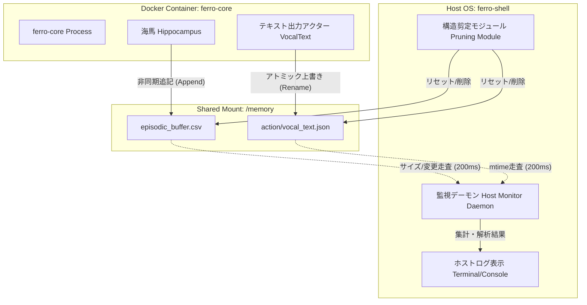
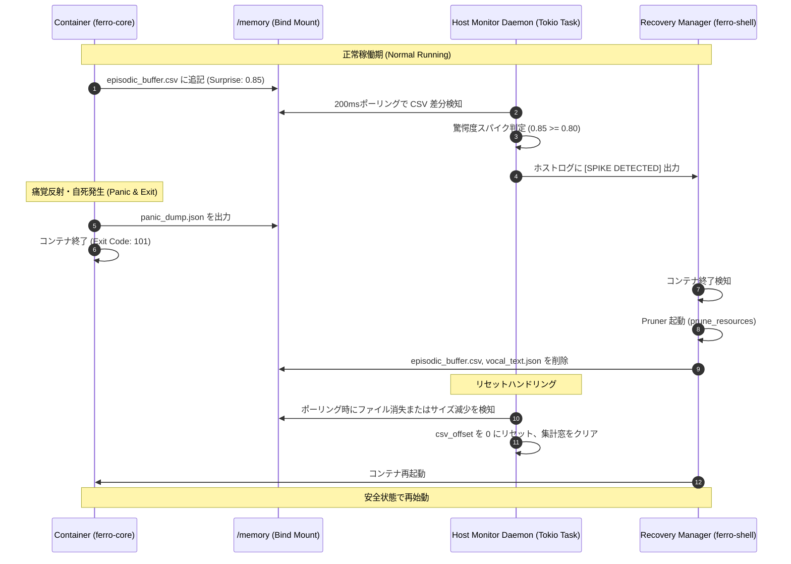

# **FERRO フェーズ2：ホスト側監視デーモンプロセス設計書**

**Version:** 1.0  
**対象領域:** `ferro-shell/` 配下のホスト側監視デーモンプロセス、`/memory` 共有マウント領域内の `episodic_buffer.csv` および `action/vocal_text.json` の監視・解析・ホストログ表示  

---

## **1. 概要と基本方針**

本ドキュメントは、FERRO システムのフェーズ2における外殻統治層（`ferro-shell`）のコア機能である **ホスト側監視デーモンプロセス（Host-side Monitoring Daemon）** の設計仕様を定義する。

### **1.1 設計背景**
`ferro-core` はセキュリティ隔離コンテナ内部で能動的推論を実行し、日中の知覚・動作履歴や驚愕度（Surprise / 予測誤差）を `/memory` 領域に出力する。コンテナ内部のプロセスは、痛覚反射（Nociceptive Reflex）や OOM Killer、Seccomp 違反によって突発的に強制終了（自死）する可能性を持つ。
そのため、コンテナの実行状態や内部の心理状態（驚愕度スパイク、発話エピソード）を安全かつ客観的に集計・解析するには、ホストOS側で動作する独立した監視デーモンが必要不可欠である。

### **1.2 基本設計方針**
1. **ホスト・サンドボックスの完全分離**: 監視デーモンはホスト環境（`ferro-shell` 内の非同期タスクまたは独立プロセス）で動作し、コンテナ内コードに依存しない。共通ファイル境界（`/memory` マウント）のみを監視対象とする。
2. **非ブロッキング・低負荷設計**: 小脳（`Cerebellum`）の 100ms 等時性ループへ影響を与えないよう、ロック競合や重いファイル I/O を排除する。
3. **対障害・状態リセット耐性**: `ferro-shell` がコンテナの異常終了を検知して構造剪定（Pruning）を実行した際、監視ファイル群が削除または初期化（サイズ縮小）されても、デーモンはパニックを起こさず自律的に追従・復旧する。

---

## **2. 監視アーキテクチャ**

監視デーモンは `ferro-shell` 起動時に並行プロセス/タスクとしてスピンアップされ、マウントディレクトリのファイル変更を走査する。

### **2.1 ファイル変更検知メカニズムの選定**
macOS などのホスト環境において Docker Desktop の bind mount（VirtioFS や gRPC FUSE）を経由する場合、ファイル変更イベント（inotify / FSEvents）がホスト・コンテナ間で正常に伝播しない場合がある。
この互換性ボトルネックを決定論的に回避するため、本監視デーモンは以下の **ハイブリッド・ポーリング方式** を採用する。

* **ポーリング（主要方式）**: 200ms 周期でファイルのメタデータ（`mtime`: 最終更新時刻、および `size`: ファイルサイズ）をチェックする。
* **フォールバック**: メタデータの変更が検出された場合のみ、ファイルの新規追加分（オフセット差分）をシークして読み取る。これにより定常的なファイルフルスキャンを回避し、ディスク I/O 負荷を極小化する。

### **2.2 アーキテクチャ構成図**



---

## **3. 対象データ仕様・スキーマ定義**

監視デーモンが解析する2つのファイルについて、その書き込みプロトコルとスキーマを定義する。

### **3.1 短期エピソードバッファ (`episodic_buffer.csv`)**

* **配置パス (ホスト側)**: `/Users/akahmys/projects/ferro/ferro-core/memory/episodic_buffer.csv`
* **書き込み挙動**: 海馬（`Hippocampus`）によって高 Surprise な事象が発生した都度、CSVの末尾に追記（Append）される。
* **スキーマ定義**:
  ```csv
  timestamp,episode_id,target_cluster_id,raw_surprise,context_hash,payload
  ```
  * `timestamp` (u64): Unix エポック秒（またはミリ秒）。
  * `episode_id` (String): 一意なエピソード識別子 (例: `ep_1781101370_001`)。
  * `target_cluster_id` (String): 処理を担当した大脳皮質クラスターID (例: `cortex_visual_02`)。
  * `raw_surprise` (f64): 中脳で算出された相殺後の驚愕度。範囲は `0.0` から `1.0` (または発散時 `INFINITY`)。
  * `context_hash` (String): 先行コンテキストのハッシュ値。
  * `payload` (String): エピソードの内容（Base64 または JSON エンコードされたテキスト）。

### **3.2 発話出力エピソード (`action/vocal_text.json`)**

* **配置パス (ホスト側)**: `/Users/akahmys/projects/ferro/ferro-core/memory/action/vocal_text.json`
* **書き込み挙動**: テキスト出力アクター（`VocalTextActor`）による発話が行われるたびに、ファイル全体がアトミックに上書き（Overwrite）される。
* **スキーマ定義**:
  ```json
  {
    "timestamp": 1781101370000,
    "origin_cluster_id": "cortex_vocal_01",
    "target_path": "memory/vocal_stream.txt",
    "text": "Initiating system check."
  }
  ```
  * `timestamp` (u64): 発話ミリ秒エポックタイム。
  * `origin_cluster_id` (String): 発話を決定した皮質クラスターID。
  * `target_path` (String): 出力ストリームファイルパス。
  * `text` (String): 実際の発話内容。

---

## **4. 解析エンジンと状態追跡ロジック**

監視デーモンは内部にステートマシンを持ち、変更分だけをメモリ効率よく処理する。

### **4.1 動的オフセット追跡 (Truncation Recovery)**
`episodic_buffer.csv` を監視する際、ファイル全体を再読み込みするのは非効率的であるため、読み込み完了バイト位置（`csv_offset: u64`）をメモリ上に保持する。

* **通常処理**: 
  1. ファイルサイズ $L_{current}$ が $csv\_offset$ より大きければ、ファイルポインタを $csv\_offset$ まで `Seek` し、差分行をパースする。
  2. 読み込み成功後、$csv\_offset \leftarrow L_{current}$ に更新。
* **リセット処理（構造剪定・再起動時）**:
  `ferro-shell` の構造剪定（Pruning）が実行されると、`episodic_buffer.csv` は削除またはゼロクリアされる。
  * **条件**: $L_{current} < csv\_offset$ となった場合（ファイルが切り詰められたことを検出）。
  * **アクション**: $csv\_offset \leftarrow 0$ にリセットし、ファイルの先頭から再度読み込みを開始する。

### **4.2 驚愕度スパイク (Surprise Spike) 判定アルゴリズム**
1. **スパイク閾値**: デフォルト値 $\theta_{spike} = 0.80$。設定ファイルまたは環境変数で調整可能とする。
2. **検知判定**: 
   新たにパースされた CSV 行の `raw_surprise` が $S_i \ge \theta_{spike}$ である場合、即座に **「驚愕度スパイク」** として検知し、警告ログイベントをトリガーする。
3. **移動統計の計算 (Sliding Window)**:
   直近 $N = 50$ 個（または過去5分間）の `raw_surprise` 値をキュー（`VecDeque`）に保持し、以下の統計値をリアルタイム更新する。
   * **ローリング平均驚愕度 (Rolling Mean Surprise)**: $\bar{S} = \frac{1}{n}\sum_{i=1}^{n} S_i$
   * **スパイク頻度 (Spike Rate)**: 過去60秒間に検知されたスパイクの回数。
   * **FEP収束・発散傾向**: 直近5ブロックの平均値から、システム全体の予測誤差が「安定（収束）」しているか「撹乱（発散）」しているかのトレンド（振幅・勾配）を算出。

### **4.3 発話エピソード同期判定**
`vocal_text.json` の読み出しにおいて重複ログ出力を防止するため、直前に処理した発話の `timestamp` を保持する。
* デーモンは `vocal_text.json` をパースし、`json.timestamp > last_vocal_timestamp` である場合のみ新規発話エピソードとして認識する。
* 認識後、`last_vocal_timestamp` を更新し、ホストログへ出力する。
* ファイルが存在しない、あるいは破損している場合は、読み飛ばして次のポーリング周期でリトライする（競合回避）。

---

## **5. ホストログ表示設計**

監視デーモンによるホストログ（コンソール出力）は、人間がシステムの「認知心理状態」を直感的に把握できるよう、レベル・カラー・絵文字を用いてフォーマットする。

### **5.1 ログ表示フォーマット**

#### **1) 通常知覚・発話イベント (INFO)**
```text
[ferro-monitor] 💬 [VOCAL] [cortex_vocal_01]: "Initiating system check."
```

#### **2) 驚愕度スパイク警告 (WARN)**
```text
[ferro-monitor] ⚠️ [SPIKE DETECTED] Surprise: 0.87 (Threshold: 0.80) | Episode: ep_1781101370_042 | Cluster: cortex_visual_02
```

#### **3) 定期心理状態サマリー (INFO / 30秒周期)**
```text
[ferro-monitor] === Rolling Cognitive Summary (Last 5m) ===
  - Avg Surprise: 0.34 [STABLE]
  - Spike Frequency: 1 spikes/min
  - Active Clusters: cortex_visual_02, cortex_vocal_01
===========================================================
```

#### **4) システム異常・パニック予兆 (ERROR)**
```text
[ferro-monitor] 🔥 [DANGER] High Spike Frequency! 5 spikes detected in the last 10s. Core memory saturation warning.
```

---

## **6. エージェント連携と自死・リカバリー統合**

ホスト側監視デーモンプロセスは、`ferro-shell` のライフサイクルおよび4大自律エージェントと密接に連携する。

### **6.1 状態同期シーケンス**



### **6.2 4大エージェントへのコンテキスト供給**
監視デーモンが蓄積した「平均驚愕度」や「スパイク発生回数」は、`ferro-shell` が次のフェーズ（睡眠期の AST 改変）へ移行する際の基礎パラメータとして供給される。
* **監督エージェント (`SupervisorAgent`)**: 
  監視デーモンから引き渡された驚愕度統計情報に基づき、皮質クラスターの適応ボトルネック領域（`ADAPTIVE_ZONE`）の改変ロードマップを策定する。
* **検証エージェント (`VerifierAgent`)**: 
  サンドボックス検証時に、テスト実行中の驚愕度スパイク発生傾向をプロファイルし、新コードが「情緒不安定（予測誤差が収束しない）」状態に陥っていないかを判定する。

---

## **7. 動作検証およびテスト仕様**

開発者は、`ferro-core` を実際にコンテナ起動することなく、ホスト側の監視デーモン単体で動作検証を行えるテストスイートを用意する。

### **7.1 テストケース設計**

#### **テストケース1: 差分読み込みとスパイク検知**
* **事前条件**: 空の `/tmp/memory` ディレクトリを作成。監視デーモンを起動。
* **操作**:
  1. `/tmp/memory/episodic_buffer.csv` を新規作成し、ヘッダー行と驚愕度 0.3 の行を書き込む。
  2. 500ms 待機後、驚愕度 0.85 の行を追記する。
* **期待される結果**:
  1. デーモンが起動し、初期行（0.3）を検知。スパイク警告は出力されない。
  2. 追記行（0.85）の検知時に、`[ferro-monitor] ⚠️ [SPIKE DETECTED]` ログが標準出力に出力されること。

#### **テストケース2: 構造剪定時のファイル切り詰め (Truncation) 復旧**
* **事前条件**: `/tmp/memory/episodic_buffer.csv` に 10 行のレコードを書き込み、監視デーモンに読み込ませる（`csv_offset > 0`）。
* **操作**:
  1. `episodic_buffer.csv` を物理削除する、もしくは `truncate -s 0` でサイズをゼロにする。
  2. 新しい CSV ヘッダーと 1 行の新規レコード（驚愕度 0.9）を書き込む。
* **期待される結果**:
  1. デーモンがパニックでクラッシュしないこと。
  2. 内部の `csv_offset` が自動的に `0` にリセットされ、切り詰め後の新規レコード（0.9）を検知してスパイクログを出力すること。

#### **テストケース3: 発話エピソードの原子性 (Atomicity) 検証**
* **事前条件**: 監視デーモン起動。
* **操作**:
  1. `vocal_text.json` にタイムスタンプ $T_1$ で発話 $A$ を書き込む。
  2. 500ms 後、タイムスタンプ $T_2$ ($T_2 > T_1$) で発話 $B$ を書き込む。
* **期待される結果**:
  1. 発話 $A$ が `[VOCAL]` ログとして 1 回のみ出力されること。
  2. 発話 $B$ が `[VOCAL]` ログとして 1 回のみ出力され、発話 $A$ の重複出力がないこと。

---

### **7.2 検証用 CLI コマンド仕様**
`ferro-shell` のデバッグ用サブコマンドとして、モックデータを共有マウントに注入してデーモン挙動を実演するコマンドを定義する。

```bash
# 監視デーモンのモック検証起動 (ドライランモード)
cargo run --bin ferro-shell -- --mode monitor-debug --memory-dir ./ferro-core/memory

# 別ターミナルからモックのスパイクデータを注入するデバッグコマンド
cargo run --bin ferro-shell -- --mode inject-mock-episode --surprise 0.92
```
これにより、開発フェーズおよび CI/CD パイプラインにおける監視健全性のテスト自動化を保証する。
