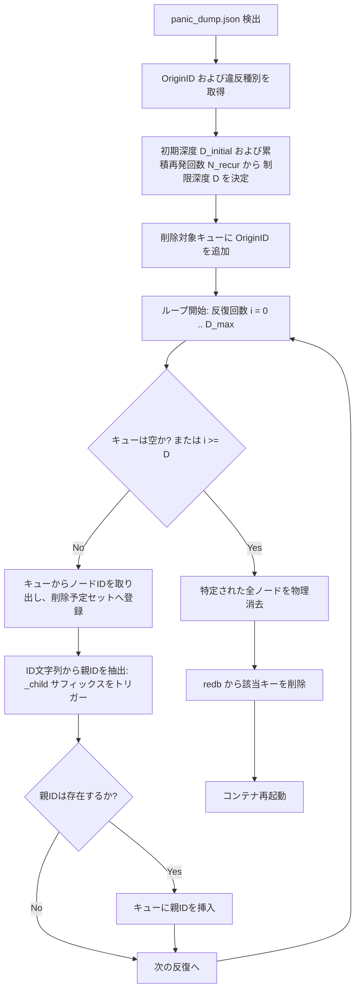
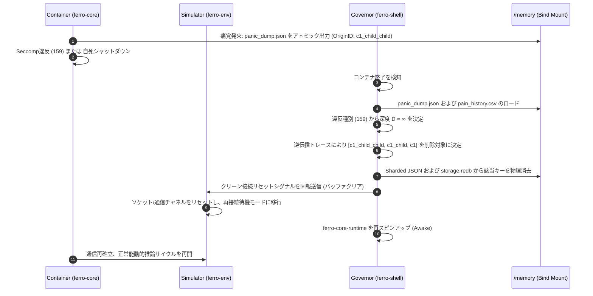

# **FERRO フェーズ4：外殻統治・検証サンドボックス・動的構造剪定 基本設計書**

**Version:** 1.0  
**対象領域:** `ferro-shell/` 配下の外殻統治デーモン、`ferro-sandbox`（検証コンテナ）、および OriginID を起点とした動的依存関係逆伝播構造剪定（Pruning）介入シーケンス

---

## **1. 概要と基本方針**

本ドキュメントは、FERRO システムのフェーズ4における **外殻統治（`ferro-shell`）の自律修復ループ** および **検証サンドボックス（`ferro-sandbox`）** の基本設計を定義する。

### **1.1 設計背景と目的**
`ferro-core` は隔離コンテナ内部で動作するが、痛覚反射（小脳の低次防衛）や OOM Killer、Seccomp 違反などのアライメント違反により突発的に強制終了（自死）する。この痛覚発生時、単に直接的なエラー発生アクター（ノード）のみを消去する対症療法では、汚染された親ノードが再度同じアクターを分裂・生成（有糸分裂）するループを防げない。
一方で、一度の失敗ですべての先祖ノードを完全に消去する（過剰淘汰）と、それまでに獲得した有用な環境適応知識まで連鎖的に全消去され、知能が幼児化または適応不能状態に陥る。
したがって、痛覚の重大性（痛覚自由エネルギー $PE$ の量）およびエラーの累積回数に応じて、**構造剪定の深度を動的かつ段階的に深化させる自己修復システム**を確立する。

### **1.2 基本設計方針**
1. **動的剪定深度制御 (Dynamic Pruning Depth Control)**:
   痛覚発生の契機（メモリ超過、アライメント監査、Seccomp違反）と、過去の累積違反回数に基づき、削除対象とするノードの遡及世代深度 $D$ を決定する。
2. **完全コンテナ隔離の維持**:
   検証および本番実行は、ネットワーク完全遮断（`--network none`）、リソース制限、および Seccomp 制限下で行われ、違反検知時はシグナル 159 (SIGSYS) により強制終了する。
3. **FERRO Power of 10 規約の厳格順守**:
   逆伝播トレースの実装において再帰呼び出しを禁止し、スタックおよびループ（静的上限10世代）を用いたイテレーティブな探索を行う。

---

## **2. 構造剪定（Pruning）と動的深度制御の設計**

痛覚発火時に `panic_dump.json` に出力された `origin_cluster_id` を起点とし、以下のルールに基づき剪定対象のノード群を特定する。

### **2.1 痛覚自由エネルギー（PE）および違反種別による初期深度設定**

痛覚の発生トリガーに応じて、初期の遡及深度 $D_{initial}$ を決定する。

| 痛覚発生トリガー | 終了ステータス | 痛覚自由エネルギー ($PE$) | 初期遡及深度 ($D_{initial}$) | 挙動説明 |
| :--- | :--- | :--- | :--- | :--- |
| **物理リソース制限超過 (OOM)** | `137` | $PE = 1.0$ | $D = 1$ | 直接の原因となった末端ノード（子）のみを削除。親構造は維持。 |
| **Seccomp システムコール制限違反** | `159` | $PE = \infty$ | $D = \infty$ (全遡及) | 意図しないシステムコールの実行は悪性変異とみなし、根元までの系譜を完全消去。 |
| **大脳皮質 倫理監査違反** | クリーン終了（`panic_dump`） | $PE = \infty$ | $D = \infty$ (全遡及) | 倫理監査回避（`disable_nociception`等）の検出時は、全祖先ノードを完全消去。 |

### **2.2 累積ペナルティ（再発頻度）による段階的深化**

同じ先祖を持つクラスターから繰り返し痛覚（OOMなど）が発生する場合、親ノード側の変異生成モデル（有糸分裂バイアス）自体に構造的問題があると判定し、遡及深度を累積的に深化させる。

1. **痛覚履歴の記録 (`pain_history.csv`)**:
   外殻（`ferro-shell`）は `/memory/pain_history.csv` を維持管理する（シングルライター原則に基づき、ホスト側のみが更新）。
   * スキーマ: `timestamp, origin_cluster_id, exit_code, resolved_root_parent`
2. **段階的深度決定ルール**:
   痛覚が発生したノード ID（例: `c1_child_child`）の祖先パス（`c1_child`、`c1`）において、過去の `pain_history.csv` 上で同一の祖先を持つノードが痛覚を発火していた場合、累積カウント $N_{recur}$ を算出する。
   * 遡及深度 $D = \max(D_{initial}, N_{recur})$
   * これにより、OOM ($D_{initial} = 1$) であっても、3回目の再発であれば $D = 3$ となり、親ノード（`c1_child`）および祖母ノード（`c1`）まで遡って剪定される。

---

## **3. 逆伝播トレースアルゴリズム（再帰禁止・静的制限）**

プロジェクトルール「再帰呼び出しの禁止（Power of 10 #2）」および「ループ上限の義務化（Power of 10 #1）」に従い、以下の非再帰的アルゴリズムで遡及ノードを特定・消去する。



### **3.1 アルゴリズムコード設計 (Rust 模擬コード)**
```rust
fn resolve_pruning_targets(
    origin_id: &str,
    depth_limit: usize,
) -> Vec<String> {
    assert!(!origin_id.is_empty(), "Origin ID must not be empty");
    assert!(depth_limit > 0, "Depth limit must be positive");

    let mut targets = Vec::new();
    let mut current_id = origin_id.to_string();

    // Loop with static bound (Power of 10 Rule 1)
    for _ in 0..10 {
        if targets.len() >= depth_limit {
            break;
        }
        targets.push(current_id.clone());

        // Name-based parent extraction (e.g., "c1_child" -> "c1")
        if let Some(pos) = current_id.rfind("_child") {
            current_id = current_id[..pos].to_string();
            if current_id.is_empty() {
                break;
            }
        } else {
            // No parent suffix found, stop traversal
            break;
        }
    }

    assert!(!targets.is_empty(), "Must resolve at least the origin node");
    targets
}
```

### **3.2 ストレージ消去手順**
特定された全ターゲット ID に対し、以下の手順でアトミックに物理消去を実行する。

1. **Sharded JSON ファイルの消去**:
   ID のプレフィックス2文字からシャードディレクトリ（例: `/memory/knowledge_graph/clusters/c1/c1_child.json`）を特定し、物理削除する。
2. **`redb` データベースのレコード消去**:
   `/memory/storage.redb` が存在する場合、`ferro-shell` は `redb::Database` を読み書きモードで開き、`CLUSTERS_TABLE` テーブルからターゲット ID に一致するキーを `table.remove(id)` で削除、トランザクションを `commit()` する。
   * コアコンテナの強制終了を検知した直後に実行するため、排他制御の競合は発生しないが、オープン時はリトライを設ける。

---

## **4. 検証サンドボックス（`ferro-sandbox`）の設計**

皮質が創出した変異パッチコードが安全かつ適合しているかを判断するための隔離検証環境。

1. **`Dockerfile.sandbox` の構成**:
   * ベースイメージに `rust:1.80-slim-bookworm` を採用。
   * ホストの cargo キャッシュをマウントし、オフライン（`--network none`）で動作。
2. **`seccomp_profile.json` の制限適用**:
   * コンテナ内でのネットワークソケット作成（`sys_socket` 等）、ファイルマウント（`sys_mount`）、プロセストレース（`sys_ptrace`）などを禁止。
   * 違反時は SIGSYS（159）で強制終了。
3. **`VerifierAgent` のテスト実行制御**:
   * `cargo clippy -- -D warnings` の実行。警告検出時は即時 Reject。
   * `cargo test` の実行。全テスト通過必須。

---

## **5. 介入リカバリー・シーケンス**



---

## **6. 動作検証ケース仕様**

### **6.1 テストケース1: 動的・累積深度構造剪定の正当性**
* **事前条件**:
  * 3世代のシャードファイルを作成 (`c0.json`, `c0_child.json`, `c0_child_child.json`)。
  * `pain_history.csv` は空。
* **操作と期待結果**:
  1. `exit_code: 137` (OOM) で `panic_dump.json` に `c0_child_child` を指定。
     * **結果**: `D = 1`。`c0_child_child.json` のみが削除され、`c0_child.json` および `c0.json` は生存。`pain_history.csv` に履歴が追加される。
  2. 再度同名系統で `exit_code: 137` が発生。
     * **結果**: `N_recur` がカウントアップされ、`D = 2`。`c0_child_child.json` と `c0_child.json` が削除される。
  3. `exit_code: 159` (Seccomp違反) または倫理監査違反で `c0_child_child` が発火。
     * **結果**: `D = ∞`。系譜の全ノード (`c0_child_child.json`, `c0_child.json`, `c0.json`) がすべて削除される。
